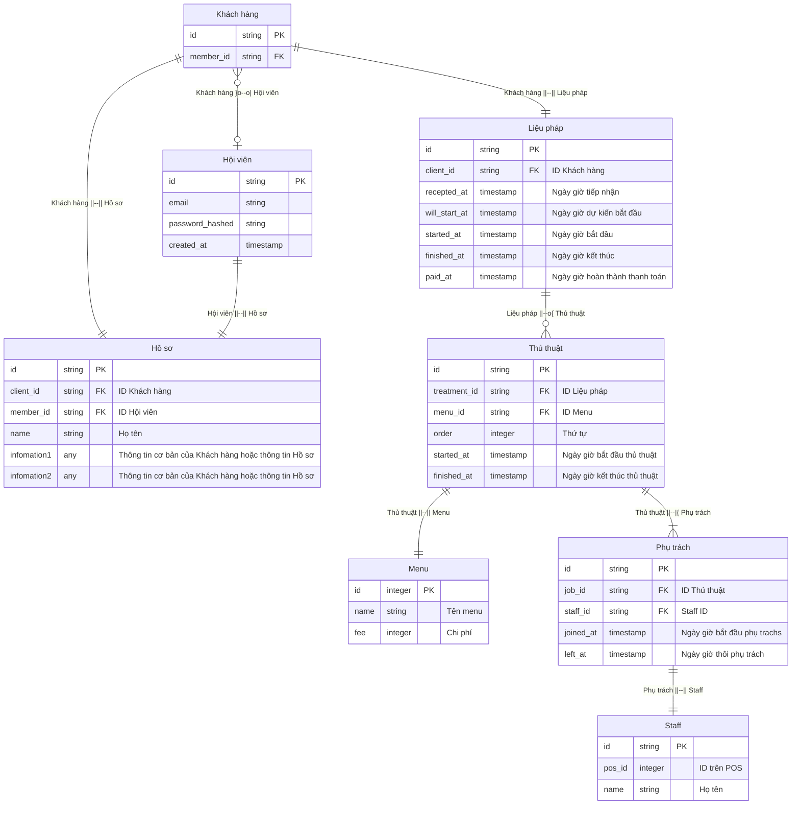

#kaoiri #ジャスティス

## ER Diagram

## Legend

|Kí hiệu|Ý nghĩa|
|:--:|:--|
|--\||one|
|--{|many|
|--\|\||one and only one|
|--o\||zero or one|
|--\|{|one or many|
|--o{|zero or many|

sequenceDiagram
actor General Director/Technical Manager/General Manager
actor Comtor
actor PM/Manager/Leader
actor Developer
actor Tester
問題を検知した人->>PM/Manager/Leader: 1.1. 問題を検知次第、報告
問題を検知した人->>Comtor: 1.1. 問題を検知次第、報告
Comtor->>Comtor: 1.2. Backlog/Githubの問題チケットを翻訳
Comtor->>PM/Manager/Leader: 1.2. 問題の担当者にアサイン
PM/Manager/Leader->>PM/Manager/Leader: 1.3. 問題の内容を確認
PM/Manager/Leader->>Developer: 1.3. 問題の担当者にアサイン
PM/Manager/Leader->>Tester: 1.3. 問題の担当者にアサイン
Comtor->>General Director/Technical Manager/General Manager: 1.4. 問題を報告
Developer->>Developer: 2.1. 問題を再現
Tester->>Tester: 2.1. 問題を再現
Tester->>PM/Manager/Leader: 2.2. 問題の再現結果を報告
Developer->>Developer: 2.3. 問題の原因を調査
Developer->>Developer: 2.4. 対策を立て、対応時間を見積もる
Developer->>PM/Manager/Leader: 3.1. 問題の調査結果を報告
PM/Manager/Leader->>PM/Manager/Leader: 3.2. 報告内容をレビュー・纏め
PM/Manager/Leader->>Comtor: 3.2. お客様に報告するようにComtorに報告内容を送る
Developer->>Developer: 4.1. 開発環境・STG環境で、問題改修
Developer->>Developer: 4.2. PR作成
Developer->>PM/Manager/Leader: 4.2. レビュー依頼
PM/Manager/Leader->>PM/Manager/Leader: 4.3. PRレビュー
PM/Manager/Leader->>Developer: 4.3. PRレビューのフィードバック
Developer->>Tester: 4.4. 開発環境・STG環境のビルドを送る
Tester->>Tester: 5. 開発環境・STG環境での改修した問題を検証
Tester->>PM/Manager/Leader: 6.1. 検証結果を纏め・報告
PM/Manager/Leader->>PM/Manager/Leader: 6.2. 検証結果報告内容をレビュー
PM/Manager/Leader->>Comtor: 6.2. お客様に報告するようにComtorに報告内容を送る
Comtor->>PM/Manager/Leader: 7.1. お客様の確認がOK・本番環境への展開の指示がある場合、PM/Manager/Leaderに報告
PM/Manager/Leader->>Developer: 7.2. 本番環境への展開を指示する
Developer->>Developer: 7.2. 本番環境への展開実施
Developer->>Comtor: 7.3. 本番環境への展開報告
PM/Manager/Leader->>PM/Manager/Leader: 8. 問題をクローズする
