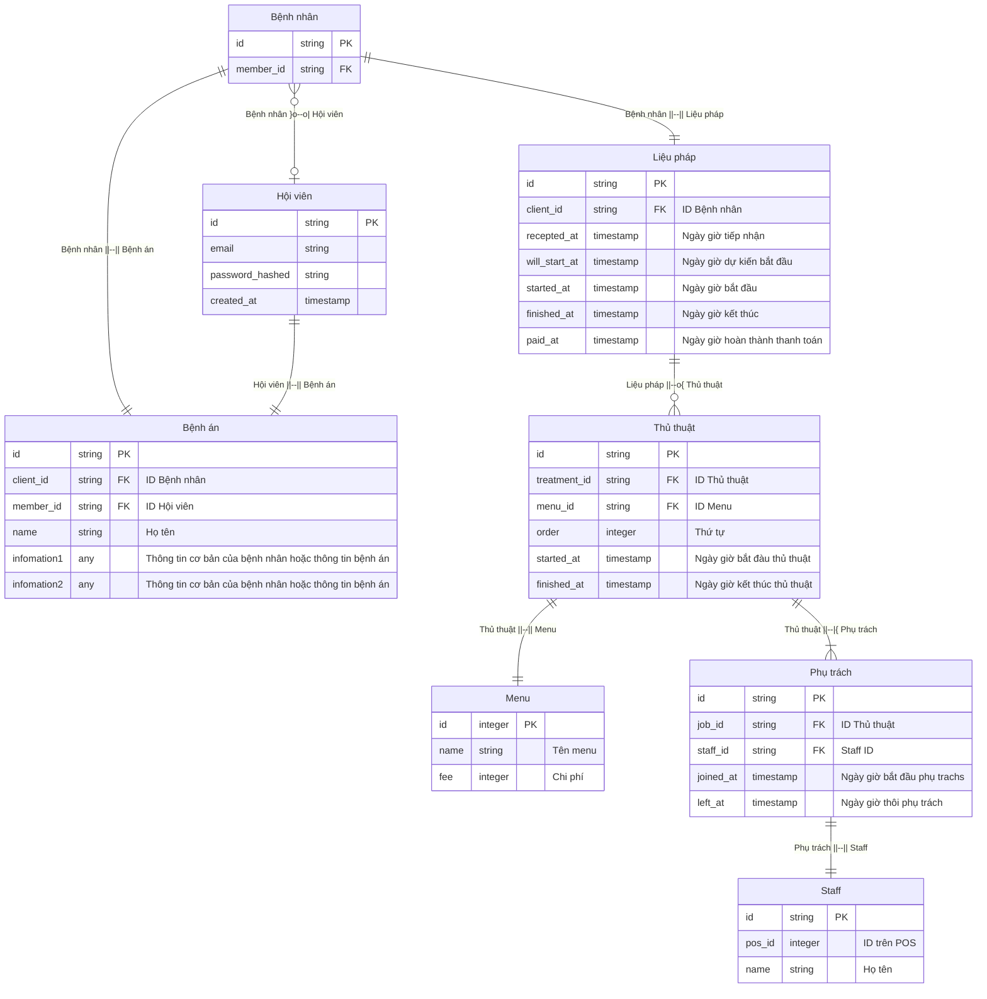

#kaoiri #ジャスティス

## ER Diagram

```mermaid
erDiagram

"Bệnh nhân" }o--o| "Hội viên": "Bệnh nhân }o--o| Hội viên"
"Bệnh nhân" ||--|| "Bệnh án": "Bệnh nhân ||--|| Bệnh án"
"Hội viên" ||--|| "Bệnh án": "Hội viên ||--|| Bệnh án"
"Bệnh nhân" ||--|| "Liệu pháp": "Bệnh nhân ||--|| Liệu pháp"
"Liệu pháp" ||--o{ "Thủ thuật": "Liệu pháp ||--o{ Thủ thuật"
"Thủ thuật" ||--|| "Menu": "Thủ thuật ||--|| Menu"
"Thủ thuật" ||--|{ "Phụ trách": "Thủ thuật ||--|{ Phụ trách"
"Phụ trách" ||--|| "Staff": "Phụ trách ||--|| Staff"

"Hội viên" {
    id string PK
    email string
    password_hashed string
    created_at timestamp
}

"Bệnh nhân" {
    id string PK
    member_id string FK
}

"Bệnh án" {
    id string PK
    client_id string FK "ID Bệnh nhân"
    member_id string FK "ID Hội viên"
    name string "Họ tên"
    infomation1 any "Thông tin cơ bản của bệnh nhân hoặc thông tin bệnh án"
    infomation2 any "Thông tin cơ bản của bệnh nhân hoặc thông tin bệnh án"
}

"Liệu pháp" {
    id string PK
    client_id string FK "ID Bệnh nhân"
    recepted_at timestamp "Ngày giờ tiếp nhận"
    will_start_at timestamp "Ngày giờ dự kiến bắt đầu"
    started_at timestamp "Ngày giờ bắt đầu"
    finished_at timestamp "Ngày giờ kết thúc"
    paid_at timestamp "Ngày giờ hoàn thành thanh toán"
}

"Menu" {
    id integer PK
    name string "Tên menu"
    fee integer "Chi phí"
}

"Thủ thuật" {
    id string PK
    treatment_id string FK "ID Thủ thuật"
    menu_id string FK "ID Menu"
    order integer "Thứ tự"
    started_at timestamp "Ngày giờ bắt đàu thủ thuật"
    finished_at timestamp "Ngày giờ kết thúc thủ thuật"
}

"Staff" {
    id string PK
    pos_id integer "ID trên POS"
    name string "Họ tên"
}

"Phụ trách" {
    id string PK
    job_id string FK "ID Thủ thuật"
    staff_id string FK "Staff ID"
    joined_at timestamp "Ngày giờ bắt đầu phụ trachs"
    left_at timestamp "Ngày giờ thôi phụ trách"
}
```

## Legend

|Kí hiệu|Ý nghĩa|
|:--:|:--|
|--\||one|
|--{|many|
|--\|\||one and only one|
|--o\||zero or one|
|--\|{|one or many|
|--o{|zero or many|
