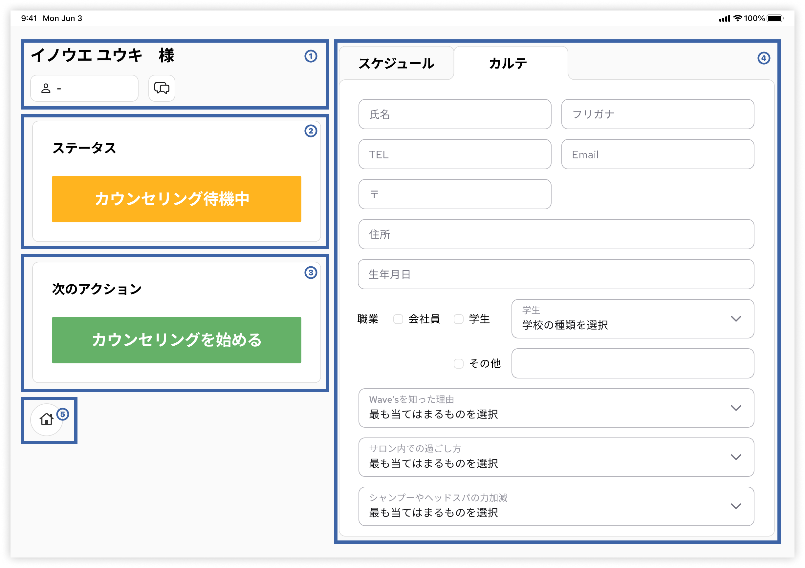

#kaoiri #ジャスティス

## List màn hình

|Màn hình|Note|
|:--|:--|
|Màn hình khởi động|Màn hình hiển thị khi chưa load được thông tin Khách hàng|
|Màn hình Liệu pháp đang chờ (Chia tab Schedule (スケジュール) và Hồ sơ (カルテタブ))|Màn hình hiển thị khi tất cả thủ thuật có mục Ngày giờ bắt đầu thủ thuật và Ngày giờ kết thúc thủ thuật đều NULL hoặc đều không NULL|
|Màn hình Liệu pháp đang thực hiện (Chia tab Schedule (スケジュール) và Hồ sơ (カルテタブ))|Màn hình hiển thị khi có thủ thuật có mục Ngày giờ bắt đầu thủ thuật không NULL và Ngày giờ kết thúc thủ thuật NULL|
|Màn hình chỉnh sửa Phụ trách|Màn hình hiển thị khi bấm vào tên của người phụ trách|
|Màn hình chờ thanh toán|Màn hình hiển thị khi đã hoàn thành tất cả thủ thuật|

## List tính năng theo màn hình

### Màn hình khởi động

<table>
    <thead>
        <tr>
            <th>Area</th>
            <th>Tính năng</th>
            <th>Phân loại</th>
            <th>Giải thích</th>
        </tr>
    </thead>
    <tbody>
        <tr>
            <th>①</th>
            <td>Hiển thị tên các Liệu pháp</td>
            <td>Hiển thị</td>
            <td>Thể hiện đang không đọc thông tin nào</td>
        </tr>
        <tr>
            <th>①</th>
            <td>Hiện thị người phụ trách</td>
            <td>Hiển thị</td>
            <td>Thể hiện đang không đọc thông tin nào</td>
        </tr>
        <tr>
            <th>①</th>
            <td>Hiển thị thông tin Hồ sơ</td>
            <td>Hiển thị</td>
            <td>Không hiển thị</td>
        </tr>
        <tr>
            <th>②</th>
            <td>Hiển thị status Liệu pháp</td>
            <td>Hiển thị</td>
            <td>
                <ul>
                    <li>Hiển thị nội dung「空席」</li>
                    <li>Status chia làm 3 loại, phân chia màu.</li>
                    <ul>
                        <li>空席 (Trống)</li>
                        <li>施術待機中 (Liệu pháp đang chờ)</li>
                        <li>施術中 (Liệu pháp đang thực hiện)</li>
                    </ul>
                </ul>
            </td>
        </tr>
        <tr>
            <th>③</th>
            <td>Thực hiện tiếp thao tác tiếp theo</td>
            <td>Button</td>
            <td>
            <ul>
                <li>Hiển thị nội dung「お客さまを座席に案内する」</li>
                <li>Thao tác được chia làm 3 loại sau, phân chia màu</li>
                <ul>
                    <li>施術客を座席に案内する (Hướng dẫn Khách hàng tới ghế chờ)</li>
                    <li>施術開始 (Bắt đầu Liệu pháp)</li>
                    <li>施術終了 (Kết thúc Liệu pháp)</li>
                </ul>
                <li>Khi bấm vào thì thực hiện những xử lý sau</li>
                <ul>
                    <li>Đọc ID Liệu pháp từ QR code bằng camera</li>
                    <li>Ghi thời gian bắt đầu Liệu pháp vào DB</li>
                    <li>Chuyển tới màn hình Liệu pháp đang chờ</li>
                </ul>
            </ul>
            </td>
        </tr>
        <tr>
            <th>④</th>
            <td>Edit schedule</td>
            <td>Thao tác, thay đổi, cập nhật data</td>
            <td>Không hiển thị hoặc thể hiện không thể edit được</td>
        </tr>
        <tr>
            <th>④</th>
            <td>Edit Hồ sơ</td>
            <td>Thao tác, thay đổi, cập nhật data</td>
            <td>Không hiển thị hoặc thể hiện không thể edit được</td>
        </tr>
    </tbody>
</table>

### Màn hình Liệu pháp đang chờ (Chia tab Schedule (スケジュール) và Hồ sơ (カルテタブ))

<table>
    <thead>
        <tr>
            <th>Area</th>
            <th>Tính năng</th>
            <th>Phân loại</th>
            <th>Giải thích</th>
        </tr>
    </thead>
    <tbody>
        <tr>
            <th>①</th>
            <td>Hiển thị tên Khách hàng</td>
            <td>Hiển thị</td>
            <td>Đọc thông tin Khách hàng từ DB bằng ID Khách hàng, hiển thị tên của Khách hàng tương ứng</td>
        </tr>
        <tr>
            <th>①</th>
            <td>Hiển thị, edit người phụ trách thủ thuật</td>
            <td>Hiển thị/Button</td>
            <td>Biểu hiện chưa có thông tin người phụ trách</td>
        </tr>
        <tr>
            <th>①</th>
            <td>Hiển thị thông tin Hồ sơ</td>
            <td>Hiển thị</td>
            <td>
                <ul>
                    <li>Đọc thông tin Khách hàng từ DB bằng ID Khách hàng, hiển thị nhưng thông tin dưới đây bằng icon</li>
                    <ul>
                        <li>Trải nghiệm trong salon</li>
                    </ul>
                </ul>
            </td>
        </tr>
        <tr>
            <th>②</th>
            <td>Hiển thị Liệu pháp</td>
            <td>Hiển thị</td>
            <td>
                <ul>
                    <li>Đọc thông tin schedule Liệu pháp (list thủ thuật) từ DB bằng ID Khách hàng hoặc bằng ID Liệu pháp, hiển thị status hiện tại</li>
                    <li>Status chia làm 3 loại sau, phân chia màu</li>
                    <ul>
                        <li>空席 (Trống)</li>
                        <li>施術待機中 (Liệu pháp đang chờ)</li>
                        <li>施術中 (Liệu pháp đang thực hiện)</li>
                    </ul>
                    <li>Vì button hiển thị trên màn hình này được phân loại là 「施術開始」 (Bắt đầu Liệu pháp), nội dung hiển thị sẽ là「.+待機中」</li>
                    <li>Trong trường hợp chưa có Thủ thuật thì hiển thị nội dung「カウンセリング待機中」</li>
                </ul>
            </td>
        </tr>
        <tr>
            <th>③</th>
            <td>Thực hiện tiếp thao tác tiếp theo</td>
            <td>Button</td>
            <td>
                <ul>
                    <li>Đọc thông tin schedule Liệu pháp (list thủ thuật) từ DB bằng ID Khách hàng hoặc bằng ID Liệu pháp, hiển thị thao tác tiếp theo</li>
                    <li>Thao tác được chia làm 3 loại sau, phân chia màu</li>
                <ul>
                    <li>施術客を座席に案内する (Hướng dẫn Khách hàng tới ghế chờ)</li>
                    <li>施術開始 (Bắt đầu Liệu pháp)</li>
                    <li>施術終了 (Kết thúc Liệu pháp)</li>
                    </ul>
                    <li>Vì nội dung hiển thị trên màn hình này được phân loại là Liệu pháp đang chờ nội dung hiển thị sẽ là「.+待機中」</li>
                    <li>Khi bấm vào thì thực hiện những xử lý sau</li>
                    <ul>
                        <li>Đọc Staff ID từ QR code bằng camera</li>
                        <li>Ghi thời gian bắt đầu Thủ thuật vào DB</li>
                        <li>Đọc thông tin schedule Liệu pháp (list thủ thuật) từ DB bằng ID Khách hàng hoặc bằng ID Liệu pháp, chuyển sang màn hình Liệu pháp đang thực hiện theo đúng thông tin đó</li>
                    </ul>
                    <li>Trong trường hợp chưa tạo schedule cho Liệu pháp (chưa có Thủ thuật), hiển thị nội dung「カウンセリング待機中」</li>
                </ul>
            </td>
        </tr>
        <tr>
            <th>④</th>
            <td>Edit schedule</td>
            <td>Thao tác, thay đổi, cập nhật data</td>
            <td>
                <ul>
                    <li>Hiển thị list menu dưới đây</li>
                    <ul>
                        <li>カウンセリング Counseling</li>
                        <li>カット Cắt</li>
                        <li>シャンプー Gội</li>
                        <li>トリートメント Dưỡng</li>
                        <li>眉カット Tỉa lông mày</li>
                        <li>カラー Nhuộm</li>
                        <li>ブリーチ Tẩy</li>
                        <li>パーマ Uốn</li>
                        <li>ヘアセット Tạo kiểu</li>
                        <li>マッサージ Massage</li>
                    </ul>
                    <li>Hiển thị schedule đã đọc được từ ID Khách hàng hoặc ID Liệu pháp</li>
                    <li>Hiển thị highlight menu đang được thực hiện trong schedule Liệu pháp (cùng màu với status LIệu pháp)</li>
                    <li>Có thể edit được schedule bằng cách bấm vào tên menu hoặc kéo và thả menu</li>
                    <li>Khi schedule được edit thì lưu lại nội dung được sửa vào DB</li>
                </ul>
            </td>
        </tr>
        <tr>
            <th>④</th>
            <td>Edit Hồ sơ</td>
            <td>Thao tác, thay đổi, cập nhật data</td>
            <td>
                <ul>
                    <li>Hiểu thị thông tin Hồ sơ đọc được từ ID Khách hàng trên form</li>
                    <li>Khi form được edit thì lưu lại nội dung được sửa vào DB</li>
                    <li>Nội dung Hồ sơ như sau</li>
                    <ul>
                        <li>氏名：テキスト Họ tên: text</li>
                        <li>フリガナ：テキスト Furigana: text</li>
                        <li>郵便番号：テキスト Mã bưu điện: text</li>
                        <li>住所：テキスト Địa chỉ: text</li>
                        <li>生年月日：日付 Ngày sinh: ngày tháng năm</li>
                        <li>電話番号：テキスト Số điện thoại: text</li>
                        <li>メールアドレス：テキスト Địa chỉ email: text</li>
                        <li>職業：単一選択 Nghề nghiệp: chọn trong list dưới đây</li>
                        <ol>
                            <li>会社員 Nhân viên văn phòng</li>
                            <li>学生 Học sinh/Sinh viên</li>
                            <ul>
                                <li>高 Cấp 3</li>
                                <li>大 Đại học</li>
                                <li>専 Trường nghề</li>
                            </ul>
                            <li>その他：テキスト Khác: nhập text</li>
                        </ol>
                        <li>店を知ったきっかけ：単一選択 Cách biết tới tiệm: chọn trong list dưới đây</li>
                        <ol>
                            <li>紹介：テキスト（紹介者名） Giới thiệu: text (tên người giới thiệu)</li>
                            <li>美容学生：テキスト（学校名） Sinh viên trường thẩm mĩ: text (tên trường)</li>
                            <li>Google検索 Google search</li>
                            <li>ホットペッパー [HotPepper](https://www.hotpepper.jp/)</li>
                            <li>Instagram</li>
                            <li>minimo</li>
                            <li>その他SNS：テキスト SNS khác</li>
                            <li>ホームページ Website của tiệm</li>
                            <li>チラシ Tờ rơi</li>
                            <li>通りすがり Đi qua</li>
                        </ol>
                        <li>サロン内での過ごし方：複数選択</li>
                        <ol>
                            <li>なるべく会話は控えたい</li>
                            <li>スタッフとの会話を楽しみたい</li>
                            <li>タブレット端末でデジタル雑誌を読みたい</li>
                            <li>ご自身のスマホを利用したい</li>
                            <li>施術内容についての説明を聞きたい</li>
                        </ol>
                        <li>シャンプーやヘッドスパでの力加減：単一選択</li>
                        <ol>
                            <li>強め</li>
                            <li>やや強め</li>
                            <li>普通</li>
                            <li>やや弱め</li>
                            <li>弱め</li>
                            <li>その都度確認してほしい</li>
                        </ol>
                        <li>今までの美容室で気になったこと：複数選択</li>
                        <ol>
                            <li>仕上がり</li>
                            <li>技術</li>
                            <li>接客</li>
                            <li>施術時間</li>
                            <li>店内の清潔さ</li>
                            <li>その他：テキスト</li>
                        </ol>
                        <li>なりたいイメージ：複数選択</li>
                        <ol>
                            <li>かわいい</li>
                            <li>ナチュラル</li>
                            <li>モテ、愛され</li>
                            <li>かっこいい</li>
                            <li>大人っぽく</li>
                            <li>似合うようにしてほしい</li>
                        </ol>
                        <li>髪についての悩み：複数選択</li>
                        <ol>
                            <li>ダメージ</li>
                            <li>カラーの色持ち</li>
                            <li>パーマの持ち</li>
                            <li>クセや広がり</li>
                            <li>ボリュームが出にくい</li>
                            <li>ホームケアの仕方</li>
                            <li>スタイリングの仕方</li>
                            <li>その他：テキスト</li>
                        </ol>
                        <li>当日の仕上がりイメージ：テキスト</li>
                        <li>施術履歴：データベースから</li>
                        <li>過去半年以内に行った施術：複数選択</li>
                        <ol>
                            <li>黒染め</li>
                            <li>ブリーチ</li>
                            <li>縮毛矯正</li>
                            <li>デジタルパーマ</li>
                            <li>ストレートパーマ</li>
                        </ol>
                        <li>希望の仕上がり時間：単一選択</li>
                        <ol>
                            <li>急いでいる：時刻（希望終了時刻）</li>
                            <li>急いでいないが希望がある：時刻（希望終了時刻）</li>
                            <li>特にない</li>
                        </ol>
                        <li>施術メニュー以外に興味のあるメニュー：複数選択</li>
                        <ol>
                            <li>カット</li>
                            <li>カラー</li>
                            <li>インナーカラー</li>
                            <li>パーマ</li>
                            <li>デジタルパーマ</li>
                            <li>縮毛矯正</li>
                            <li>トリートメント</li>
                            <li>ヘッドスパ</li>
                            <li>眉カット</li>
                            <li>その他：テキスト</li>
                        </ol>
                        <li>おすすめ商品の紹介を希望するか：単一選択</li>
                        <ol>
                            <li>はい</li>
                            <li>いいえ</li>
                        </ol>
                        <li>自宅でのヘアケアについて：単一選択</li>
                        <ol>
                            <li>サロンで購入したもの</li>
                            <li>市販のもの</li>
                            <li>特にしていない</li>
                        </ol>
                        <li>利用しているSNS：複数選択</li>
                        <ol>
                            <li>Instagram</li>
                            <li>Twitter</li>
                            <li>TikTok</li>
                            <li>LINE</li>
                            <li>Facebook</li>
                            <li>YouTube</li>
                            <li>Clubhouse</li>
                            <li>その他：テキスト</li>
                        </ol>
                        <li>その他の要望：テキストエリア</li>
                        <li>管理用メモ：テキストエリア</li>
                    </ul>
                </ul>
            </td>
        </tr>
        <tr>
            <th>⑤</th>
            <td>スタートに戻る</td>
            <td>ボタン</td>
            <td>
                <ul>
                    <li>タップ時は以下の処理を行う</li>
                    <ul>
                        <li>ホーム画面に遷移する</li>
                    </ul>
                </ul>
            </td>
        </tr>
    </tbody>
</table>

### Màn hình Liệu pháp đang thực hiện (Chia tab Schedule (スケジュール) và Hồ sơ (カルテタブ))

<table>
    <thead>
        <tr>
            <th>Area</th>
            <th>Tính năng</th>
            <th>Phân loại</th>
            <th>Giải thích</th>
        </tr>
    </thead>
    <tbody>
        <tr>
            <th>①</th>
            <td>施術客名表示</td>
            <td>表示</td>
            <td>施術客IDでデータベースから施術客情報を読み込み、その施術客名を表示する</td>
        </tr>
        <tr>
            <th>①</th>
            <td>作業担当者表示・編集</td>
            <td>表示・ボタン</td>
            <td>
                <ul>
                    <li>作業中の作業IDでデータベースから作業担当者情報を読み込み、担当終了時刻が空の担当者名をすべて表示する</li>
                    <li>タップ時は以下の処理を行う</li>
                    <ul>
                        <li>「担当者編集画面」に遷移する</li>
                    </ul>
                </ul>
            </td>
        </tr>
        <tr>
            <th>①</th>
            <td>カルテ情報表示</td>
            <td>表示</td>
            <td>
                <ul>
                    <li>施術客IDでデータベースからカルテ情報を読み込み、以下の情報をアイコンで表示する</li>
                    <ul>
                        <li>サロン内での過ごし方</li>
                    </ul>
                </ul>
            </td>
        </tr>
        <tr>
            <th>②</th>
            <td>施術ステータス表示</td>
            <td>表示</td>
            <td>
                <ul>
                    <li>施術客IDまたは施術IDでデータベースから施術スケジュール情報（作業一覧）を読み込み、現在のステータスを表示する</li>
                    <li>ステータスは以下の3種類に分類し、色分けする</li>
                    <ul>
                        <li>空席</li>
                        <li>施術待機中</li>
                        <li>施術中</li>
                    </ul>
                    <li>この画面が表示されるのは「施術中」に分類されるステータスのため、「.+中」という表示になる</li>
                </ul>
            </td>
        </tr>
        <tr>
            <th>③</th>
            <td>次のアクションを行う</td>
            <td>ボタン</td>
            <td>
                <ul>
                    <li>施術客IDまたは施術IDでデータベースから施術スケジュール情報（作業一覧）を読み込み、次のアクションを表示する</li>
                    <li>アクションは以下の3種類に分類し、色分けする</li>
                    <ul>
                        <li>施術客を座席に案内する</li>
                        <li>施術開始</li>
                        <li>施術終了</li>
                    </ul>
                    <li>この画面に表示されるのは「施術終了」に分類されるアクションのため、「.+を終了する」という表示になる</li>
                    <li>タップ時は以下の処理を行う</li>
                    <ul>
                        <li>データベースに作業終了時刻を記録する</li>
                        <li>施術客IDまたは施術IDから施術スケジュール（作業一覧）を読み込み、以下の通り画面を遷移する。</li>
                        <ul>
                            <li>次の作業がある場合：「施術待機画面」</li>
                            <li>次の作業がない場合：「会計待機画面」</li>
                        </ul>
                    </ul>
                </ul>
            </td>
        </tr>
        <tr>
            <th>④</th>
            <td>スケジュール編集</td>
            <td>データ操作</td>
            <td>
                <ul>
                    <li>以下のメニュー一覧を表示</li>
                    <ul>
                        <li>カウンセリング</li>
                        <li>カット</li>
                        <li>シャンプー</li>
                        <li>トリートメント</li>
                        <li>眉カット</li>
                        <li>カラー</li>
                        <li>ブリーチ</li>
                        <li>パーマ</li>
                        <li>ヘアセット</li>
                        <li>マッサージ</li>
                    </ul>
                    <li>施術客IDまたは施術IDで読み込んだ施術スケジュールを表示</li>
                    <li>施術スケジュール内の現在作業中のメニューをハイライト表示（施術ステータスと同じ色）</li>
                    <li>メニューをタップまたはドラッグアンドドロップで施術スケジュールを編集できる</li>
                    <li>施術スケジュールが編集された時、その内容をデータベースに保存する</li>
                </ul>
            </td>
        </tr>
        <tr>
            <th>④</th>
            <td>カルテ編集</td>
            <td>データ操作</td>
            <td>
                <ul>
                    <li>施術客IDで読み込んだカルテ情報を入力フォーム上に表示</li>
                    <li>フォームが編集された時、その内容をデータベースに保存する</li>
                    <li>カルテの内容は以下の通り</li>
                    <ul>
                        <li>氏名：テキスト</li>
                        <li>フリガナ：テキスト</li>
                        <li>郵便番号：テキスト</li>
                        <li>住所：テキスト</li>
                        <li>生年月日：日付</li>
                        <li>電話番号：テキスト</li>
                        <li>メールアドレス：テキスト</li>
                        <li>職業：単一選択</li>
                        <ol>
                            <li>会社員</li>
                            <li>学生</li>
                            <ul>
                                <li>高</li>
                                <li>大</li>
                                <li>専</li>
                            </ul>
                            <li>その他：テキスト</li>
                        </ol>
                        <li>店を知ったきっかけ：単一選択</li>
                        <ol>
                            <li>紹介：テキスト（紹介者名）</li>
                            <li>美容学生：テキスト（学校名）</li>
                            <li>Google検索</li>
                            <li>ホットペッパー</li>
                            <li>Instagram</li>
                            <li>minimo</li>
                            <li>その他SNS：テキスト</li>
                            <li>ホームページ</li>
                            <li>チラシ</li>
                            <li>通りすがり</li>
                        </ol>
                        <li>サロン内での過ごし方：複数選択</li>
                        <ol>
                            <li>なるべく会話は控えたい</li>
                            <li>スタッフとの会話を楽しみたい</li>
                            <li>タブレット端末でデジタル雑誌を読みたい</li>
                            <li>ご自身のスマホを利用したい</li>
                            <li>施術内容についての説明を聞きたい</li>
                        </ol>
                        <li>シャンプーやヘッドスパでの力加減：単一選択</li>
                        <ol>
                            <li>強め</li>
                            <li>やや強め</li>
                            <li>普通</li>
                            <li>やや弱め</li>
                            <li>弱め</li>
                            <li>その都度確認してほしい</li>
                        </ol>
                        <li>今までの美容室で気になったこと：複数選択</li>
                        <ol>
                            <li>仕上がり</li>
                            <li>技術</li>
                            <li>接客</li>
                            <li>施術時間</li>
                            <li>店内の清潔さ</li>
                            <li>その他：テキスト</li>
                        </ol>
                        <li>なりたいイメージ：複数選択</li>
                        <ol>
                            <li>かわいい</li>
                            <li>ナチュラル</li>
                            <li>モテ、愛され</li>
                            <li>かっこいい</li>
                            <li>大人っぽく</li>
                            <li>似合うようにしてほしい</li>
                        </ol>
                        <li>髪についての悩み：複数選択</li>
                        <ol>
                            <li>ダメージ</li>
                            <li>カラーの色持ち</li>
                            <li>パーマの持ち</li>
                            <li>クセや広がり</li>
                            <li>ボリュームが出にくい</li>
                            <li>ホームケアの仕方</li>
                            <li>スタイリングの仕方</li>
                            <li>その他：テキスト</li>
                        </ol>
                        <li>当日の仕上がりイメージ：テキスト</li>
                        <li>施術履歴：データベースから</li>
                        <li>過去半年以内に行った施術：複数選択</li>
                        <ol>
                            <li>黒染め</li>
                            <li>ブリーチ</li>
                            <li>縮毛矯正</li>
                            <li>デジタルパーマ</li>
                            <li>ストレートパーマ</li>
                        </ol>
                        <li>希望の仕上がり時間：単一選択</li>
                        <ol>
                            <li>急いでいる：時刻（希望終了時刻）</li>
                            <li>急いでいないが希望がある：時刻（希望終了時刻）</li>
                            <li>特にない</li>
                        </ol>
                        <li>施術メニュー以外に興味のあるメニュー：複数選択</li>
                        <ol>
                            <li>カット</li>
                            <li>カラー</li>
                            <li>インナーカラー</li>
                            <li>パーマ</li>
                            <li>デジタルパーマ</li>
                            <li>縮毛矯正</li>
                            <li>トリートメント</li>
                            <li>ヘッドスパ</li>
                            <li>眉カット</li>
                            <li>その他：テキスト</li>
                        </ol>
                        <li>おすすめ商品の紹介を希望するか：単一選択</li>
                        <ol>
                            <li>はい</li>
                            <li>いいえ</li>
                        </ol>
                        <li>自宅でのヘアケアについて：単一選択</li>
                        <ol>
                            <li>サロンで購入したもの</li>
                            <li>市販のもの</li>
                            <li>特にしていない</li>
                        </ol>
                        <li>利用しているSNS：複数選択</li>
                        <ol>
                            <li>Instagram</li>
                            <li>Twitter</li>
                            <li>TikTok</li>
                            <li>LINE</li>
                            <li>Facebook</li>
                            <li>YouTube</li>
                            <li>Clubhouse</li>
                            <li>その他：テキスト</li>
                        </ol>
                        <li>その他の要望：テキストエリア</li>
                        <li>管理用メモ：テキストエリア</li>
                    </ul>
                </ul>
            </td>
        </tr>
        <tr>
            <th>⑤</th>
            <td>スタートに戻る</td>
            <td>ボタン</td>
            <td>
                <ul>
                    <li>タップ時は以下の処理を行う</li>
                    <ul>
                        <li>ホーム画面に遷移する</li>
                    </ul>
                </ul>
            </td>
        </tr>
    </tbody>
</table>

### Màn hình chỉnh sửa Phụ trách

<table>
    <thead>
        <tr>
            <th>Area</th>
            <th>Tính năng</th>
            <th>Phân loại</th>
            <th>Giải thích</th>
        </tr>
    </thead>
    <tbody>
        <tr>
            <th>①</th>
            <td>担当者の追加</td>
            <td>ボタン</td>
            <td>
                <ul>
                    <li>タップ時は以下の操作を行う</li>
                    <ul>
                        <li>カメラでQRコードからスタッフIDを読み込む</li>
                        <li>作業担当者としてスタッフIDと担当開始時刻をデータベースに保存する</li>
                    </ul>
                </ul>
            </td>
        </tr>
        <tr>
            <th>①</th>
            <td>担当者の変更</td>
            <td>ボタン</td>
            <td>
                <ul>
                    <li>タップ時は以下の操作を行う</li>
                    <ul>
                        <li>タップされた作業担当者に担当終了時刻を追加してデータベースを更新する</li>
                        <li>カメラでQRコードからスタッフIDを読み込む</li>
                        <li>作業担当者としてスタッフIDと担当開始時刻をデータベースに保存する</li>
                    </ul>
                </ul>
            </td>
        </tr>
        <tr>
            <th>①</th>
            <td>担当者の削除</td>
            <td>ボタン</td>
            <td>
                <ul>
                    <li>タップ時は以下の操作を行う</li>
                    <ul>
                        <li>タップされた作業担当者に担当終了時刻を追加してデータベースを更新する</li>
                    </ul>
                </ul>
            </td>
        </tr>
    </tbody>
</table>

### Màn hình chờ thanh toán

<table>
    <thead>
        <tr>
            <th>Area</th>
            <th>Tính năng</th>
            <th>Phân loại</th>
            <th>Giải thích</th>
        </tr>
    </thead>
    <tbody>
        <tr>
            <th>①</th>
            <td>施術客名表示</td>
            <td>表示</td>
            <td>施術客IDでデータベースから施術客情報を読み込み、その施術客名を表示する</td>
        </tr>
        <tr>
            <th>①</th>
            <td>作業担当者表示・編集</td>
            <td>表示・ボタン</td>
            <td>担当者が登録されていないことを明示する</td>
        </tr>
        <tr>
            <th>①</th>
            <td>カルテ情報表示</td>
            <td>表示</td>
            <td>
                <ul>
                    <li>施術客IDでデータベースからカルテ情報を読み込み、以下の情報をアイコンで表示する</li>
                    <ul>
                        <li>サロン内での過ごし方</li>
                    </ul>
                </ul>
            </td>
        </tr>
        <tr>
            <th>②</th>
            <td>施術ステータス表示</td>
            <td>表示</td>
            <td>
                <ul>
                    <li>「会計待機中」と表示する</li>
                    <li>ステータスは以下の3種類に分類し、色分けする</li>
                    <ul>
                        <li>空席</li>
                        <li>施術待機中</li>
                        <li>施術中</li>
                    </ul>
                </ul>
            </td>
        </tr>
        <tr>
            <th>③</th>
            <td>次のアクションを行う</td>
            <td>ボタン</td>
            <td>
                <ul>
                    <li>「作業を終了して会計に進む」と表示する</li>
                    <li>アクションは以下の3種類に分類し、色分けする</li>
                    <ul>
                        <li>施術客を座席に案内する</li>
                        <li>施術開始</li>
                        <li>施術終了</li>
                    </ul>
                    <li>タップ時は以下の処理を行う</li>
                    <ul>
                        <li>データベースに施術終了時刻を記録する</li>
                        <li>「スタート画面」に遷移する</li>
                    </ul>
                </ul>
            </td>
        </tr>
        <tr>
            <th>④</th>
            <td>スケジュール編集</td>
            <td>データ操作</td>
            <td>
                <ul>
                    <li>以下のメニュー一覧を表示</li>
                    <ul>
                        <li>カウンセリング</li>
                        <li>カット</li>
                        <li>シャンプー</li>
                        <li>トリートメント</li>
                        <li>眉カット</li>
                        <li>カラー</li>
                        <li>ブリーチ</li>
                        <li>パーマ</li>
                        <li>ヘアセット</li>
                        <li>マッサージ</li>
                    </ul>
                    <li>施術客IDまたは施術IDで読み込んだ施術スケジュールを表示</li>
                    <li>施術スケジュール内の現在作業中のメニューをハイライト表示（施術ステータスと同じ色）</li>
                    <li>メニューをタップまたはドラッグアンドドロップで施術スケジュールを編集できる</li>
                    <li>施術スケジュールが編集された時、その内容をデータベースに保存する</li>
                </ul>
            </td>
        </tr>
        <tr>
            <th>④</th>
            <td>カルテ編集</td>
            <td>データ操作</td>
            <td>
                <ul>
                    <li>施術客IDで読み込んだカルテ情報を入力フォーム上に表示</li>
                    <li>フォームが編集された時、その内容をデータベースに保存する</li>
                    <li>カルテの内容は以下の通り</li>
                    <ul>
                        <li>氏名：テキスト</li>
                        <li>フリガナ：テキスト</li>
                        <li>郵便番号：テキスト</li>
                        <li>住所：テキスト</li>
                        <li>生年月日：日付</li>
                        <li>電話番号：テキスト</li>
                        <li>メールアドレス：テキスト</li>
                        <li>職業：単一選択</li>
                        <ol>
                            <li>会社員</li>
                            <li>学生</li>
                            <ul>
                                <li>高</li>
                                <li>大</li>
                                <li>専</li>
                            </ul>
                            <li>その他：テキスト</li>
                        </ol>
                        <li>店を知ったきっかけ：単一選択</li>
                        <ol>
                            <li>紹介：テキスト（紹介者名）</li>
                            <li>美容学生：テキスト（学校名）</li>
                            <li>Google検索</li>
                            <li>ホットペッパー</li>
                            <li>Instagram</li>
                            <li>minimo</li>
                            <li>その他SNS：テキスト</li>
                            <li>ホームページ</li>
                            <li>チラシ</li>
                            <li>通りすがり</li>
                        </ol>
                        <li>サロン内での過ごし方：複数選択</li>
                        <ol>
                            <li>なるべく会話は控えたい</li>
                            <li>スタッフとの会話を楽しみたい</li>
                            <li>タブレット端末でデジタル雑誌を読みたい</li>
                            <li>ご自身のスマホを利用したい</li>
                            <li>施術内容についての説明を聞きたい</li>
                        </ol>
                        <li>シャンプーやヘッドスパでの力加減：単一選択</li>
                        <ol>
                            <li>強め</li>
                            <li>やや強め</li>
                            <li>普通</li>
                            <li>やや弱め</li>
                            <li>弱め</li>
                            <li>その都度確認してほしい</li>
                        </ol>
                        <li>今までの美容室で気になったこと：複数選択</li>
                        <ol>
                            <li>仕上がり</li>
                            <li>技術</li>
                            <li>接客</li>
                            <li>施術時間</li>
                            <li>店内の清潔さ</li>
                            <li>その他：テキスト</li>
                        </ol>
                        <li>なりたいイメージ：複数選択</li>
                        <ol>
                            <li>かわいい</li>
                            <li>ナチュラル</li>
                            <li>モテ、愛され</li>
                            <li>かっこいい</li>
                            <li>大人っぽく</li>
                            <li>似合うようにしてほしい</li>
                        </ol>
                        <li>髪についての悩み：複数選択</li>
                        <ol>
                            <li>ダメージ</li>
                            <li>カラーの色持ち</li>
                            <li>パーマの持ち</li>
                            <li>クセや広がり</li>
                            <li>ボリュームが出にくい</li>
                            <li>ホームケアの仕方</li>
                            <li>スタイリングの仕方</li>
                            <li>その他：テキスト</li>
                        </ol>
                        <li>当日の仕上がりイメージ：テキスト</li>
                        <li>施術履歴：データベースから</li>
                        <li>過去半年以内に行った施術：複数選択</li>
                        <ol>
                            <li>黒染め</li>
                            <li>ブリーチ</li>
                            <li>縮毛矯正</li>
                            <li>デジタルパーマ</li>
                            <li>ストレートパーマ</li>
                        </ol>
                        <li>希望の仕上がり時間：単一選択</li>
                        <ol>
                            <li>急いでいる：時刻（希望終了時刻）</li>
                            <li>急いでいないが希望がある：時刻（希望終了時刻）</li>
                            <li>特にない</li>
                        </ol>
                        <li>施術メニュー以外に興味のあるメニュー：複数選択</li>
                        <ol>
                            <li>カット</li>
                            <li>カラー</li>
                            <li>インナーカラー</li>
                            <li>パーマ</li>
                            <li>デジタルパーマ</li>
                            <li>縮毛矯正</li>
                            <li>トリートメント</li>
                            <li>ヘッドスパ</li>
                            <li>眉カット</li>
                            <li>その他：テキスト</li>
                        </ol>
                        <li>おすすめ商品の紹介を希望するか：単一選択</li>
                        <ol>
                            <li>はい</li>
                            <li>いいえ</li>
                        </ol>
                        <li>自宅でのヘアケアについて：単一選択</li>
                        <ol>
                            <li>サロンで購入したもの</li>
                            <li>市販のもの</li>
                            <li>特にしていない</li>
                        </ol>
                        <li>利用しているSNS：複数選択</li>
                        <ol>
                            <li>Instagram</li>
                            <li>Twitter</li>
                            <li>TikTok</li>
                            <li>LINE</li>
                            <li>Facebook</li>
                            <li>YouTube</li>
                            <li>Clubhouse</li>
                            <li>その他：テキスト</li>
                        </ol>
                        <li>その他の要望：テキストエリア</li>
                        <li>管理用メモ：テキストエリア</li>
                    </ul>
                </ul>
            </td>
        </tr>
        <tr>
            <th>⑤</th>
            <td>スタートに戻る</td>
            <td>ボタン</td>
            <td>
                <ul>
                    <li>タップ時は以下の処理を行う</li>
                    <ul>
                        <li>ホーム画面に遷移する</li>
                    </ul>
                </ul>
            </td>
        </tr>
    </tbody>
</table>
