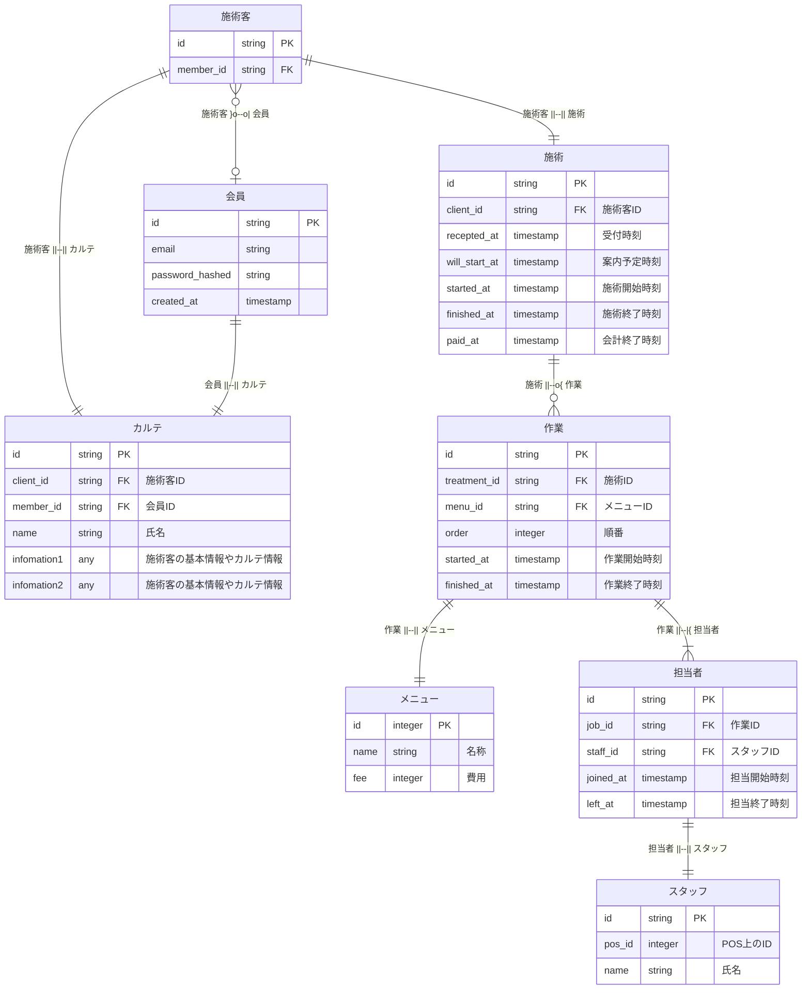

#kaoiri #ジャスティス

## ER図

```mermaid
erDiagram

"施術客" }o--o| "会員": "施術客 }o--o| 会員"
"施術客" ||--|| "カルテ": "施術客 ||--|| カルテ"
"会員" ||--|| "カルテ": "会員 ||--|| カルテ"
"施術客" ||--|| "施術": "施術客 ||--|| 施術"
"施術" ||--o{ "作業": "施術 ||--o{ 作業"
"作業" ||--|| "メニュー": "作業 ||--|| メニュー"
"作業" ||--|{ "担当者": "作業 ||--|{ 担当者"
"担当者" ||--|| "スタッフ": "担当者 ||--|| スタッフ"

"会員" {
    id string PK
    email string
    password_hashed string
    created_at timestamp
}

"施術客" {
    id string PK
    member_id string FK
}

"カルテ" {
    id string PK
    client_id string FK "施術客ID"
    member_id string FK "会員ID"
    name string "氏名"
    infomation1 any "施術客の基本情報やカルテ情報"
    infomation2 any "施術客の基本情報やカルテ情報"
}

"施術" {
    id string PK
    client_id string FK "施術客ID"
    recepted_at timestamp "受付時刻"
    will_start_at timestamp "案内予定時刻"
    started_at timestamp "施術開始時刻"
    finished_at timestamp "施術終了時刻"
    paid_at timestamp "会計終了時刻"
}

"メニュー" {
    id integer PK
    name string "名称"
    fee integer "費用"
}

"作業" {
    id string PK
    treatment_id string FK "施術ID"
    menu_id string FK "メニューID"
    order integer "順番"
    started_at timestamp "作業開始時刻"
    finished_at timestamp "作業終了時刻"
}

"スタッフ" {
    id string PK
    pos_id integer "POS上のID"
    name string "氏名"
}

"担当者" {
    id string PK
    job_id string FK "作業ID"
    staff_id string FK "スタッフID"
    joined_at timestamp "担当開始時刻"
    left_at timestamp "担当終了時刻"
}
```

## 凡例

|記号|意味|
|:--:|:--|
|--\||one|
|--{|many|
|--\|\||one and only one|
|--o\||zero or one|
|--\|{|one or many|
|--o{|zero or many|
